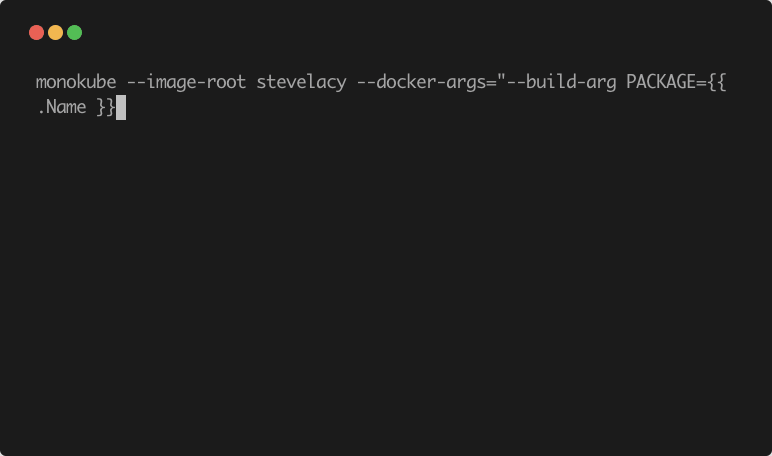

# monokube
> Monorepo deployment management

Works with lerna, yarn, and stand-alone monorepos




```
$ monokube --image-root stevelacy

building 1 package(s)
Step 1/8 : FROM golang:1.14.11-alpine3.11 as build_image
...
 ---> 18d162cff2a9
Successfully tagged stevelacy/example-1:1.2.3-d80f667
built image: stevelacy/example-1:1.2.3-d80f667
The push refers to repository [docker.io/stevelacy/example-1]
...
running deployments
deployment.apps/example-1 configured
service/example-1-staged unchanged
Waiting for deployment "example-1" rollout to finish: 1 out of 3 new replicas have been updated...
Waiting for deployment "example-1" rollout to finish: 2 out of 3 new replicas have been updated...
Waiting for deployment "example-1" rollout to finish: 1 old replicas are pending termination...
deployment "example-1" successfully rolled out
running post-deployment tasks
service/example-1 unchanged
ingress.extensions/example-1 configured
deployment "example-1" successfully rolled out
all done
```


All together:
```
monokube \
	--image-root stevelacy \
	--docker-args="--build-arg PACKAGE={{ .Name }}" \
	--cluster-name $CLUSTER_NAME \
	--only-packages example-1 \
	--diff "0132547" \
	--path ./packages \
	--skip-packages example-1 \
	--command post-deploy
```

#### Templating

All manifests in the `package/kube/` folder are templated with the provided arguments and the ENV

```
apiVersion: apps/v1
kind: Deployment
metadata:
  name: {{ .Name }}
  namespace: {{ .Env.NAMESPACE }}
  labels:
    app: {{ .Name }}
    version: {{ .Version }}

```

Default values provided:
```
Name:     package folder name
Image:    built docker image
Version:  `version` field from `package/package.json`
Env:      key/value map of the current ENV
```

### Arguments

#### Image Root
> --image-root
String **required**

This sets the root of a docker image.

Example:
```
--image-root stevelacy becomes stevelacy/package
--image-root gcr.io/project becomes gcr.io/project/package
```

#### Command
> --command
String _optional_ build | deploy | post-deploy


#### Path
> --path
String _optional_
Default: `packages`

monokube looks for packages in the path provided or in the `packages` key of a `lerna.json` file.


#### Dry Run
> --dry-run
Bool _optional_

This will build all docker images and run a deployment with `--dry-run` set. It does not push the images.


#### Output
> --output (-o)
String _optional_  yaml | json


#### Docker Args
> --docker-args
String _optional_

This is passed into the docker build command directly.

Example:
```
--docker-args="--build-arg PACKAGE={{ .Name }}"
--docker-args="--compress --memory 512"
```

#### Cluster Name
> --cluster-name
String _optional_

If provided only the packages with the --cluster-name in their `kube/deploy.json` will be deployed

```
--cluster-name dev
```

`./packages/example-1/kube/deploy.json`
```
{
	"clusters": [ "dev" ]
}
```

#### Diff
> --diff
String _optional_

Deploys a package only when there are changes between the current repo HEAD and the provided git commit


#### Skip Packages
> --skip-packages
String _optional_

Skip building or deploying provided packages

```
--skip-packages example-1 example-2
```


#### Only Packages
> --only-packages
String _optional_

Only build or deploy provided packages

```
--only-packages example-1 example-2
```
